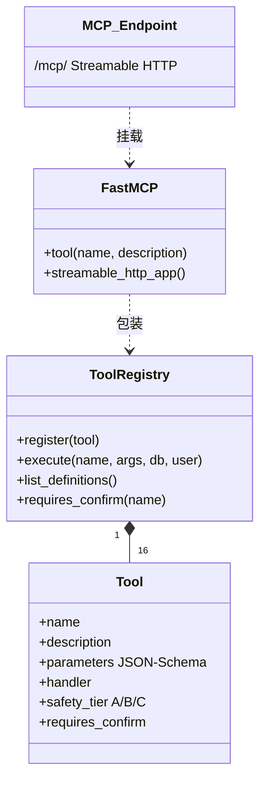
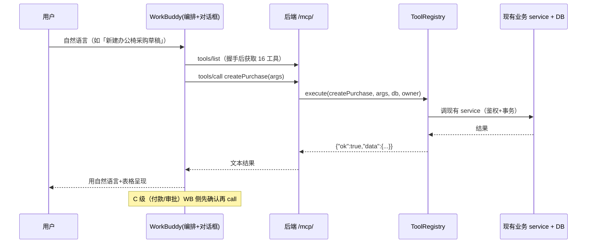

# 万能对话框（财务 Copilot）— 系统架构设计 + 任务分解 v0.2（方案 B）

> 配套：连接器接入 `ai-copilot-mcp-connector.md` · 产品需求 `ai-copilot-prd.md` · 框架设计 `ai-copilot-design.md`
> 决策基线：6 项已拍板（2026-07-26 07:17）。**2026-07-26 翻转为方案 B** —— 财务 app 从「主编排 + 调 WorkBuddy 推理」改为「**只当 MCP 工具执行方**」，WorkBuddy 当主编排 + 对话框。

---

## 1. 实现方案 + 框架选型（方案 B）

- **调转主从（B 核心）**：
  - **WorkBuddy = 主编排 + 对话框**（负责读对话 + 工具定义 + 吐文本/tool_call + 确认 UX）。
  - **财务 app = 工具执行方 + 鉴权 + 业务权限**（采购/报销/发票三域工具，经 MCP 暴露）。
  - 流程：WorkBuddy 对话 → 调本后端 MCP 端点 `/mcp/` 的工具 → 后端用 `ToolRegistry` **鉴权执行**（复用现有业务 service）→ 结果回 WorkBuddy → 继续对话。
- **后端**：沿用 FastAPI + **FastMCP（无状态 Streamable HTTP）**，挂在 `/mcp/`。零新增前端依赖（前端对话 UI 由 WorkBuddy 提供，本 app 不写 Copilot 面板）。
- **复用 T1–T5 成果**：`tools.py` 的 16 个工具 + A/B/C 安全分级是「金子」，B 方案直接复用，仅需把 `ToolRegistry` 包成 MCP 服务。
- **会话**：B 方案下对话/历史由 WorkBuddy 侧负责；本 app 的 `AiSession`/`AiMessage`（T1/T5）**保留但闲置**（后续若要本地落库可再用）。

## 2. 文件列表及相对路径

**后端（新模块 `app/services/ai/` + 路由挂载）**

| 文件 | 职责 | 状态 |
|---|---|---|
| `app/models/ai_session.py` | `AiSession` + `AiMessage` 模型 | ✅ 保留（闲置） |
| `app/services/ai/provider.py` | `WorkBuddyProvider` 等（A 方案推理用） | ✅ 保留（闲置，B 不需要） |
| `app/services/ai/tools.py` | `ToolRegistry` + 三域 16 工具包装 | ✅ **B 的核心复用** |
| `app/services/ai/prompts.py` | 系统提示 + 安全分级（A 方案用） | ✅ 保留（闲置） |
| `app/services/ai/session.py` | 会话/消息落库 CRUD（A 方案用） | ✅ 保留（闲置） |
| `app/services/ai/mcp_server.py` | **FastMCP 包装 ToolRegistry，挂 `/mcp/`** | ✅ **B 新增核心** |
| `app/main.py` | `app.mount("/mcp/", ...)` + lifespan 启动 MCP 会话管理器（改 2 处） | ✅ 已改 |

**取消（B 不需要，A 方案才要）**：`api/ai_chat.py`(SSE 路由)、`agent.py`(编排循环)、前端 `api/aiChat.ts` / `CopilotPanel.vue` / `MessageRenderer.vue` / `Home.vue` 改造。

## 3. 数据结构和接口（类图）

**工具入参契约**：`Tool.parameters`（JSON Schema）即 MCP `inputSchema` 的来源，`mcp_server.py` 用动态签名（`inspect.Signature` + 类型注解）把 JSON Schema 推导为 FastMCP 的 inputSchema，**零漂移**。C 级工具 `requires_confirm=True`，供 WorkBuddy 侧拦截二次确认。

## 4. 程序调用流程（时序图，方案 B）

## 5. 任务列表（已落地 / 取消）

| # | 任务 | 状态 |
|---|---|---|
| T1 | `models/ai_session.py` 建模型 | ✅ 已落地（闲置） |
| T2 | `provider.py` Provider 抽象 + WorkBuddy 实接 | ✅ 已落地（闲置，B 不需） |
| T3 | `tools.py` ToolRegistry + 三域 16 工具 | ✅ **已落地（B 核心复用）** |
| T4 | `prompts.py` 系统提示 + 安全分级 | ✅ 已落地（闲置） |
| T5 | `session.py` 会话落库 CRUD | ✅ 已落地（闲置） |
| T-MCP | `mcp_server.py`：FastMCP 包装 ToolRegistry；`main.py` 挂 `/mcp/` + lifespan 启动会话管理器 | ✅ **已落地（B 核心新增）** |
| T6 | `agent.py` 编排循环（A 方案） | ❌ 取消（B 由 WorkBuddy 编排） |
| T7 | `api/ai_chat.py` SSE 路由（A 方案） | ❌ 取消 |
| T9–T12 | 前端 Copilot 面板/渲染/挂载（A 方案） | ❌ 取消（对话框在 WorkBuddy） |
| T13 | `tests/test_mcp.py`：MCP 端点冒烟（list_tools=16 / call_tool 读写） | 🟡 待补 |
| T14 | 前端渲染测试 | ❌ 取消 |

**实现顺序（已执行）**：`T1 → T2/T3/T4（并行）→ T5 → T-MCP（包装+挂载+验证）`。验证用 MCP 官方 Python 客户端跑通 initialize → list_tools(16) → call_tool（listPurchases 读 / createPurchase 写草稿）。

## 6. 依赖包列表

- **后端**：新增 `mcp>=1.28.0`（FastMCP + Streamable HTTP 传输）。**注意 `mcp` 要求 Python ≥ 3.10**，本机后端 venv 已从 3.9.6 升到 **3.13.x**（路径不变 `.venv`，依赖按冻结清单还原 + mcp）。其余 fastapi/uvicorn/pydantic/sqlalchemy/python-multipart 沿用。
- **前端**：方案 B 下**零新增**（不写 Copilot 面板）。

## 7. 共享知识（跨文件约定）

1. **工具执行必须在 app 内**：`ToolRegistry.execute(name, args, db, user)` 复用现有 service（**不重复写业务逻辑**），权限/事务留在 app。
2. **MCP 端点 = `/mcp/`**（带尾斜杠）。FastMCP `streamable_http_path="/"` + `app.mount("/mcp/", ...)` → 对外 `/mcp/`；`/mcp`（无斜杠）会 307 重定向到 `/mcp/`。
3. **无状态（stateless_http=True）**：每次请求独立 DB Session（engine 已 `check_same_thread=False`），无跨调用会话；MCP 会话管理器的任务组由 `main.py` lifespan 显式 `run()` 启动（`streamable_http_app()` 自身不带 lifespan）。
4. **可选鉴权**：`MCP_AUTH_TOKEN` 环境变量设置后，要求 `Authorization: Bearer <token>`（否则 401）；未设置则本地放行。连接器 headers 与之对应。
5. **安全分级沿用**：A 直接执行；B 创建草稿；C（付款/审批）`requires_confirm=True`，由 WorkBuddy 侧做二次确认 UX。
6. **闲置文件无害**：`provider.py`/`prompts.py`/`session.py`/`ai_session.py` 在 B 方案下不导入、不运行，保留以备查与未来本地会话落库。

## 8. 待明确事项（老板定/提供）

1. **WorkBuddy 连接器**：已明确 —— 自定义连接器 `type: http`，url `http://127.0.0.1:8521/mcp/`（详见 `ai-copilot-mcp-connector.md`）。✅
2. **C 级确认 UX**：由 WorkBuddy 侧负责（工具已标记 `requires_confirm`，可据此拦截）。本 app 侧不实现确认流程。
3. **跨机/公网暴露**：按 §7.4 设 `MCP_AUTH_TOKEN` + 连接器带 Bearer；并放行 8521 端口/防火墙。同机（127.0.0.1）最稳。
4. **会话持久化**：B 方案默认 WorkBuddy 侧负责；若后续要本地落库，启用 `AiSession`/`AiMessage`（已就绪）。
