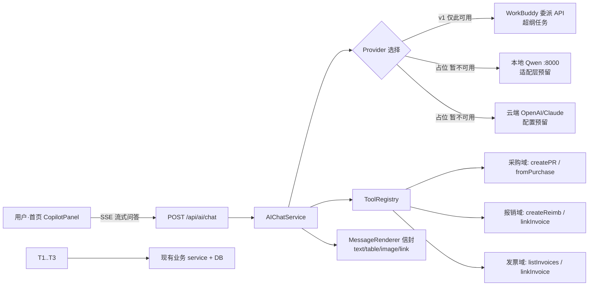

# 万能对话框（财务 Copilot）— 框架与技术方案（决策已定稿 v1.0）

> 状态：**决策已定**（2026-07-26 07:17 老板拍板 6 项）。进入标准 SOP：PRD(`ai-copilot-prd.md`) → 架构+任务分解(`ai-copilot-arch.md`) → 工程师 → QA。
> 背景：把"现在的对话框"移植进 mfr-cloud-finance 首页。纯问答、无页面无按钮，自然语言办业务；选链接哪个大模型；最好能调用 WorkBuddy；复杂产出进报表。

---

## 0. 产品一句话

把"现在的对话框"搬进软件首页：**纯问答、无页面无按钮**，用自然语言把业务办了；太复杂的产出，进报表看。

---

## 1. 产品形态（对齐老板原话）

- 首页常驻一个**对话面板**（可浮动 / 抽屉式），顶部一个**模型选择器**（本地 Qwen / 云端模型 / WorkBuddy 委派）。
- 全程问答：用户打字提问 → 系统回答案（**文字 / 表格 / 图片 / 深链**）。
- 没有页面跳转、没有业务按钮（除输入框和模型选择外）。
- 业务通过对话完成：录单、挂发票、查报表、问数据，都靠说。
- 复杂反馈 → 系统提示"已生成报表，去 报表→X 看"，附深链。

---

## 2. 总体架构

### 2.1 分层

| 层 | 职责 | 复用 / 新增 |
|---|---|---|
| 前端 UI 层 | CopilotPanel（对话 + 模型选择）+ MessageRenderer（富消息）+ SSE 客户端 | 新增 |
| 网关/路由层 | `POST /api/ai/chat`（SSE 流式），全程 `get_current_user` 鉴权 | 新增路由 |
| Agent 层 | `AIChatService`：选 Provider → 组装系统提示 → 工具调度循环 → 流式聚合 | 新增 |
| 工具层 | `ToolRegistry`：把现有业务 service 包装成函数调用工具 | 新增 |
| Provider 层 | 抽象不同模型（本地 / 云端 / WorkBuddy 委派），统一 Chat/FunctionCalling 接口 | 新增 |
| 业务/数据层 | 现有 FastAPI routers + SQLAlchemy models + service 层；工具执行复用既有权限与事务 | **复用** |

### 2.2 架构图

---

## 3. 关键技术决策（★ 6 项已拍板）

> 2026-07-26 07:17 老板定稿，详见 `ai-copilot-prd.md` / `ai-copilot-arch.md`。

1. **模型策略 v1**：先只做「框架 + WorkBuddy 委派」占位，本地 / 云端暂留适配层不接；**等业务数据跑通**（明早清发票重入后）再扩。
2. **写类动作安全**：纯对话确认，无按钮；C 级（支付 / 记账 / 反审核）用一句确认代替（"将向 XX 支付 ¥ZZZ，回复'确认'执行"）。
3. **答案渲染**：纯 Markdown 表格（不引入 el-table 交互组件），富消息走 MD。
4. **WorkBuddy 姿势**：委派式 (A) —— 财务 app 自含轻量 agent + 业务工具，超纲任务委派 WorkBuddy。
5. **v1 工具范围**：**采购 / 报销 / 发票** 三域先行。
6. **会话落库 & 跨设备**：存历史（落本地库），**不跨设备、不 multiple 端**，仅本机。

---

## 4. 与 WorkBuddy 的关系（已定：委派式 A）

- 财务 app 自含轻量 agent + 业务工具（采购/报销/发票）；超纲任务（画图 / 研究 / 编码 / 长文分析）委派给 WorkBuddy API。
- WorkBuddy 作为**唯一 v1 可用的 Provider 通道**（本地/云端为占位），不阻塞业务工具主链路。
- 具体委派端点（URL/鉴权/流式协议）为**待明确事项**，需在架构阶段由老板提供或走 WorkBuddy 连接器。

---

## 5. 文件结构与任务分解

> 完整文件列表 + 有序任务（含依赖）+ 时序图，见 `ai-copilot-arch.md`。

后端新模块 `app/services/ai/` + `app/api/ai_chat.py`；前端 `CopilotPanel.vue` / `MessageRenderer.vue` / `aiChat.ts` + 改造 `Home.vue`。预估 >10 文件 → 标准 SOP。

---

## 6. 不在 v1 范围（先不做）

- 语音输入 / 输出
- 多模态图片识别（发票仍走现有发票箱上传，不混进对话框）
- 向量库 RAG
- 工作流编排（多步自动化）
- 本地 / 云端模型实接（仅占位）
- 跨设备 / 多端同步
