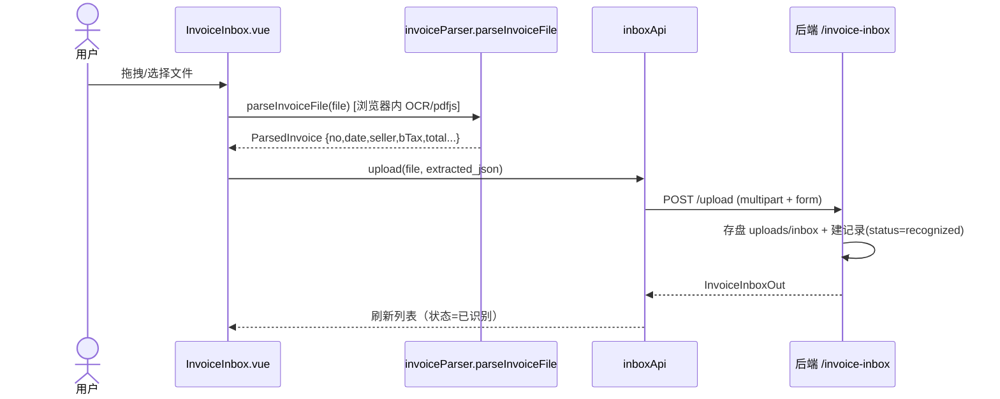
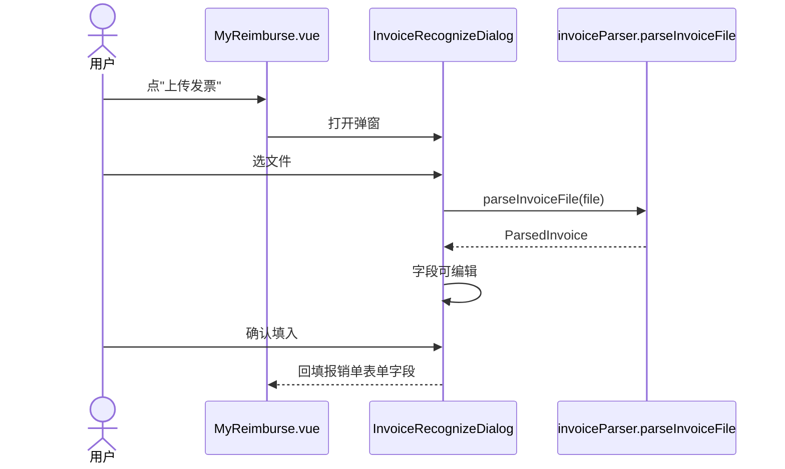
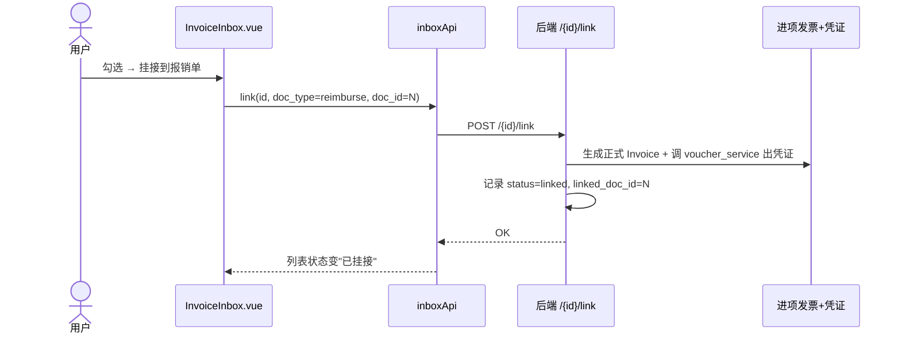

# 架构设计 + 任务分解：发票识别工具（发票箱 + 内嵌识别 + OCR 兜底 + 查验）

> 产出角色：架构师 高见远（Gao）
> 输入：PRD `docs/prd-invoice-recognition.md`（老板已确认全部 5 条待确认按建议）
> 系统底座：Vue3 + Vite 前端 / FastAPI + SQLAlchemy + SQLite 后端 / 登录 admin/admin123 / 后端端口 8521

---

## 1. 实现方案 + 框架选型

**沿用现有技术栈，零新框架。** 关键认识：浏览器端 OCR/解析能力**已经存在**——`frontend/src/utils/invoiceParser.ts` 的 `parseInvoiceFile(file)` 已能处理 PDF(pdfjs) / 图片(tesseract.js) / OFD(jszip) 并返回结构化 `ParsedInvoice`，且 `views/invoice/InvoiceInput.vue` 已在用。所以本工具**不写新解析逻辑**，只做两件事：

1. **收口到发票箱**：前端调 `parseInvoiceFile` 拿到字段 → 连同原文件上传后端 `invoice_inbox` 表存档（原文件存盘、DB 只存路径与提取 JSON）。
2. **挂接到业务**：发票箱勾选 → 带入报销/采购录入；确认后生成正式进项发票记录 + 自动凭证（复用现有 `voucher_service` 联动，保持"业务驱动账务"灵魂）。

**OCR 位置**：P0 全在浏览器（tesseract.js），原始文件内容不出浏览器做 OCR 计算；原文件仍上传后端存档（按待确认 #4）。后端**不引入 OCR 服务/依赖**。

---

## 2. 文件列表及相对路径

### 后端（新增 / 修改）
| 路径 | 动作 | 说明 |
|------|------|------|
| `backend/app/models/invoice_inbox.py` | 新增 | `InvoiceInbox` ORM 模型 |
| `backend/app/schemas/invoice_inbox.py` | 新增 | Pydantic `InvoiceInboxIn/Out` |
| `backend/app/api/invoice_inbox.py` | 新增 | 路由：上传/列表/详情/校正/挂接/查验 |
| `backend/app/db/__init__.py` 或 `database.py` 的 `init_db` | 修改 | 导入新模型，确保 `create_all` 建表 |
| `backend/app/main.py` | 修改 | `app.include_router(invoice_inbox.router, prefix="/api", dependencies=_AUTH_DEP)` |
| `backend/uploads/inbox/` | 新增目录 | 原文件存档（mirror 现有 `ARTHIVE_DIR` 模式） |
| `backend/.gitignore` | 修改 | 忽略 `uploads/inbox/`（原文件不入库） |

### 前端（新增 / 修改）
| 路径 | 动作 | 说明 |
|------|------|------|
| `frontend/src/api/inboxApi.ts` | 新增 | 封装发票箱接口 |
| `frontend/src/views/invoice/InvoiceInbox.vue` | 新增 | 发票箱页（列表/拖拽上传/批量识别/状态/校正/挂接） |
| `frontend/src/components/InvoiceRecognizeDialog.vue` | 新增 | 内嵌识别弹窗（上传→parseInvoiceFile→可编辑→填入/存箱） |
| `frontend/src/types/invoice.ts` | 修改 | 新增 `InvoiceInbox` 类型 |
| `frontend/src/views/reimburse/MyReimburse.vue` | 修改 | 加"上传发票/重新识别"按钮，打开弹窗 |
| `frontend/src/views/purchase/MyPurchase.vue` | 修改 | 同上 |
| `frontend/src/router/index.ts` | 修改 | 加 `invoice/inbox` 路由（`meta.group:'发票'`, `module:'accounting'`，侧边栏自动生成） |
| `frontend/src/utils/invoiceParser.ts` | 复用（验证） | 确认 `parseInvoiceFile` 对图片走 tesseract 并返回结构化 |

---

## 3. 数据结构与接口

### 3.1 `InvoiceInbox` 模型（`app/models/invoice_inbox.py`）
```
InvoiceInbox:
  id              : int PK
  filename        : str            # 原始文件名
  storage_path    : str            # uploads/inbox/<id>_<name>
  source          : enum(upload, box)        # 来源
  extracted_json  : Text           # ParsedInvoice 的 JSON 字符串
  status          : enum(pending, recognized, linked, error)
  linked_doc_type : enum(reimburse, purchase, null)
  linked_doc_id   : int null
  verify_result   : enum(none, real, fake, abnormal)   # P1 查验
  verify_note     : str null
  created_at      : datetime
  recognized_at   : datetime null
  linked_at       : datetime null
```

### 3.2 后端 API（`/api/invoice-inbox`，全部挂 `_AUTH_DEP`）
| Method | Path | 说明 |
|--------|------|------|
| POST | `/upload` | `UploadFile` + `extracted_json: str`(Form) → 存盘 + 建记录（有 json→recognized，无→pending） |
| GET  | `/` | 列表，query: `status?`, `keyword?` |
| GET  | `/{id}` | 详情 |
| PUT  | `/{id}` | 人工校正提取字段（body: 字段） |
| POST | `/{id}/link` | body: `{doc_type, doc_id}` → 置 linked + 生成正式进项发票 + 凭证 |
| POST | `/{id}/verify` | P1：body: `{result, note}` → 记录查验结果 |
| DELETE | `/{id}` | 删除记录 + 删存档文件 |

### 3.3 复用约定
- 上传存盘：**直接照抄** `app/api/invoice.py` 的 `upload_attachment`（`ARTHIVE_DIR.mkdir(parents=True, exist_ok=True)` + `await file.read()` + 写盘）。发票箱用独立 `INBOX_DIR = BASE_DIR/"uploads"/"inbox"`。
- 挂接生成正式发票：复用 `app/api/invoice.py` 现有创建接口（或对应 service），生成 `m.Invoice` 记录 + 调 `voucher_service` 自动凭证，保证与现有进项发票/凭证联动一致。

---

## 4. 程序调用流程（时序图）

### 4.1 发票箱上传 + 识别


### 4.2 内嵌"重新识别"（报销/采购录入）


### 4.3 挂接到报销/采购


---

## 5. 任务列表（有序、含依赖）

| # | 任务 | 依赖 | 落点 |
|---|------|------|------|
| T1 | 后端模型 `invoice_inbox.py` + 注册到 `init_db`（导入以触发 `create_all`） | 无 | 后端 |
| T2 | 后端 schema `invoice_inbox.py`（In/Out） | 无 | 后端 |
| T3 | 后端路由 `api/invoice_inbox.py`：upload/list/detail/put/link/verify/delete（mirror `upload_attachment` 存盘） | T1,T2 | 后端 |
| T4 | `main.py` 注册路由 + 建 `INBOX_DIR` + `.gitignore` 忽略 `uploads/inbox/` | T3 | 后端 |
| T5 | 挂接逻辑：`/{id}/link` 生成正式 `Invoice` + 调 `voucher_service` 凭证 | T3 | 后端 |
| T6 | 前端类型 `types/invoice.ts` 加 `InvoiceInbox` | 无 | 前端 |
| T7 | 前端 `api/inboxApi.ts`（封装 6 个接口） | T3(契约) | 前端 |
| T8 | 验证 `invoiceParser.parseInvoiceFile` 对图片走 tesseract 并返回结构化（已有，确认即可） | 无 | 前端 |
| T9 | 前端 `InvoiceInbox.vue`：列表 + 拖拽上传 + 批量识别 + 状态色 + 校正/挂接按钮 + 去重提示(P1) + 查验标记(P1) | T6,T7,T8 | 前端 |
| T10 | 前端 `InvoiceRecognizeDialog.vue`：上传→parse→可编辑→填入/存箱 | T6,T7,T8 | 前端 |
| T11 | `MyReimburse.vue` / `MyPurchase.vue` 接入"上传发票"按钮打开弹窗 | T10 | 前端 |
| T12 | `router/index.ts` 加 `invoice/inbox` 路由（侧边栏自动出菜单） | T9 | 前端 |

> 说明：T6/T7/T8 与 T1~T5 相互独立，可前后端并行；T9/T10/T11/T12 为前端收口，T12 依赖 T9 页面存在。

---

## 6. 依赖包列表

**无新增依赖。**
- 前端：`pdfjs-dist`、`jszip`、`tesseract.js` —— 已由 `invoiceParser.ts` 引入并验证，本工具直接复用 `parseInvoiceFile`。
- 后端：`fastapi`、`sqlalchemy`、`pydantic`、`python-multipart`（现有 `upload_attachment` 已用 `UploadFile`，确认已装即可）。后端**不引入 OCR 包**。

---

## 7. 共享知识（跨文件约定）

1. **提取字段 schema**：`extracted_json` 内容 == `ParsedInvoice`（`invoiceParser` 输出）：`{ no, date, buyer, seller, bTax, sTax, total, amount, tax, items:[...] }`。前后端共用此结构，不另起一套。
2. **枚举值统一**：
   - `status`：`pending` / `recognized` / `linked` / `error`
   - `source`：`upload` / `box`
   - `linked_doc_type`：`reimburse` / `purchase` / `null`
   - `verify_result`（P1）：`none` / `real` / `fake` / `abnormal`
3. **去重键**：`sTax + no`（销售方税号 + 发票号码）。上传/挂接时比对箱内已有 + 已挂接正式发票，重复则提示。
4. **文件存档**：`INBOX_DIR/<id>_<originalname>`，mirror 现有 `ARTHIVE_DIR` 模式；DB 只存 `storage_path` 字符串。
5. **解析铁律**：所有识别一律走 `invoiceFields.ts` 宽松解析；**不为任何票面写专属解析器**（死板，老板已否）。
6. **鉴权**：发票箱所有路由挂 `_AUTH_DEP`，与现有 `main.py` 一致。
7. **业务联动**：挂接生成正式发票 + 凭证，必须复用现有 `voucher_service`，不得另写凭证逻辑，保证"业务驱动账务"一致。

---

## 8. 待明确事项（实现阶段细化）

1. **`init_db` 模型导入点**：需确认新模型是加在 `app/models/__init__.py` 还是 `database.py` 的 `init_db` 内 import；必须保证在 `Base.metadata.create_all` **之前**导入，否则表不建。
2. **生成正式发票的函数**：现有创建逻辑在 `app/api/invoice.py`（或对应 service），T5 实现时定位并复用，确认凭证科目映射与现有进项发票一致。
3. **tesseract 并发**：批量识别建议限并发 2，避免浏览器内存峰值；worker 初始化一次复用。
4. **上传大小限制**：前端约定单文件上限（如 20MB），后端守常规 multipart 限制。
5. **OCR 准确率上限**：火车票/行程单这类版式属已知限制（P0 前端 tesseract），P2 评估后端 OCR 提升；本期不阻塞交付。
6. **查验（P1）轻量形态**：前端"跳税务局查验平台"按钮（按 发票号+税号+金额+日期 拼 URL/填表）+ 后端 `/verify` 仅记录人工结果；完整 API 对接留 P1 末/P2。
