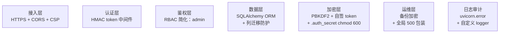

# AICoding 架构设计 · 智慧经营 — 安全设计

> 本文档为《AICoding 架构设计》核心产物之一，对应**安全设计**。
> 上游输入：《系统设计》中的鉴权、上传、API 设计；
> 下游输出：可执行的访问控制、密钥管理、日志审计、保护方案。

---

## 1. 安全总体架构

### 1.1 安全分层



### 1.2 安全原则

- **零信任**：所有业务路由必须通过 `get_current_user` 校验
- **最小暴露**：CORS 白名单仅本地源；SQLite 不暴露端口
- **最小权限**：单一 admin 角色，避免 RBAC 复杂化
- **审计留痕**：所有 5xx 异常 logger.exception 记录
- **密钥不落代码**：`AUTH_SECRET` 环境变量优先，其次 `.auth_secret` 文件

---

## 2. 资产识别与威胁建模

### 2.1 资产清单

| 资产 | 类别 | 敏感度 |
| --- | --- | --- |
| SQLite 文件 (`smart_finance.db`) | 公司所有财务数据 | **最高** |
| `backend/.auth_secret` | HMAC 密钥 | **最高** |
| `backend/uploads/invoices/` | 发票原文件 | 高 |
| `backend/uploads/inbox/` | 发票箱原文件 | 高 |
| 用户密码哈希 | accounts.password_hash | 中 |
| 凭证、发票、合同数据 | DB 表 | 高 |

### 2.2 威胁模型（STRIDE）

| 威胁 | 风险 | 影响 | 缓解 |
| --- | --- | --- | --- |
| **S**poofing（伪装）| 凭证窃取 | 业务数据可见 | HMAC token + 30 天有效期 |
| **T**ampering（篡改）| 数据库文件被改 | 财务数据失真 | 文件 chmod + 备份 + 文件完整性校验（建议） |
| **R**epudiation（否认）| 操作无审计 | 责任不清 | uvicorn.access + uvicorn.error 日志 |
| **I**nformation Disclosure（泄露）| 500 堆栈泄露 | 内部细节暴露 | 全局异常 handler 包装 |
| **D**enial of Service（拒绝服务）| 大文件上传 | 磁盘占满 | 上传大小限制（建议）|
| **E**levation of Privilege（提权）| SQL 注入 | 全库读写 | SQLAlchemy ORM（参数化） |

---

## 3. 网络与传输安全

| 控制点 | 实现 |
| --- | --- |
| HTTPS | Nginx 反向代理 + 本地自签证书或 Let's Encrypt |
| CORS | `_ALLOWED_ORIGINS = [localhost:8521, 127.0.0.1:8521, localhost:5173, 127.0.0.1:5173]` |
| 端口暴露 | 8521 仅监听 127.0.0.1，外部需经 Nginx |
| Token 传输 | `Authorization: Bearer <token>` 头（HTTP Header，非 Cookie） |
| CSP | 建议 Nginx 设置 `Content-Security-Policy: default-src 'self'` |

---

## 4. 认证与授权

### 4.1 认证流程

```
登录
  POST /api/auth/login {username, password}
    ↓ security.verify_password (PBKDF2 + 恒定时间比较)
    ↓ 密码正确 → accounts 表查 employee
    ↓ security.generate_token (HMAC-SHA256 自签, 30 天)
  返回 {token, username, role, employee_no, name}
```

### 4.2 Token 校验（中间件）

```
每个业务路由:
  @router.get("/...")
  def list_xxx(current: Account = Depends(get_current_user)):
      ...

get_current_user:
  1. 从 Authorization 头读取 Bearer <token>
  2. security.verify_token: HMAC 校验 + exp 校验
  3. 失败 → 401 未登录或登录已过期
  4. 成功 → 返回 Account 对象
```

### 4.3 密码安全

| 项 | 实现 |
| --- | --- |
| 算法 | PBKDF2-HMAC-SHA256 |
| 迭代 | 100,000 |
| 盐 | 16 字节随机 hex |
| 存储格式 | `pbkdf2_sha256$iterations$salt$hash(hex)` |
| 比较 | `secrets.compare_digest` 防止时序侧信道 |

### 4.4 Token 安全

| 项 | 实现 |
| --- | --- |
| 算法 | HMAC-SHA256 自签（不依赖第三方 JWT 库） |
| 格式 | `header.payload.signature` (3 段 base64url) |
| payload | `{sub, role, emp, exp}` |
| 有效期 | 30 天（可在前端拦截器检测临近过期） |
| 密钥存储 | `.auth_secret` 文件（首启随机 32 字节 hex + chmod 600） |
| 密钥优先级 | `AUTH_SECRET > 文件 > 内存随机` |

### 4.5 授权简化

- 当前仅 `admin` 单一角色
- 全公司仅 1 个账号（30 人公司）
- 未来扩：可加入 `finance/admin/viewer` 三级

---

## 5. 会话与密钥管理

### 5.1 密钥生命周期

| 阶段 | 处理 |
| --- | --- |
| 生成 | `secrets.token_hex(32)` 64 字符 hex |
| 持久化 | `.auth_secret` 文件，仅本机用户可读写 |
| 失效 | 需轮换（完整版任务）|
| 备份 | 备份 tar 包内包含 `.auth_secret`（同库同密钥恢复） |

### 5.2 密钥轮换建议（完整版）

```python
# 1) 设置新密钥到环境变量
export AUTH_SECRET="$(openssl rand -hex 32)"

# 2) 重启后端
pkill -f "uvicorn app.main"
.venv/bin/python -m uvicorn app.main:app --port 8521 &

# 3) 新 token 自动用新密钥签发
# 4) 老 token 全部失效（无宽限期）— 须重新登录
# 5) 备份新 .auth_secret
cp backend/.auth_secret ~/backups/$(date +%Y%m%d)_auth_secret
```

### 5.3 文件权限

```bash
chmod 600 backend/.auth_secret
chmod 700 backend/uploads/
chmod 600 backend/smart_finance.db
```

---

## 6. 数据安全

### 6.1 数据分类

| 分类 | 数据 | 保护 |
| --- | --- | --- |
| 公开 | 商品名、税率 | 无特殊处理 |
| 内部 | 员工工资、报销金额 | 限登录可见 |
| 机密 | 密码哈希、HMAC 密钥 | 文件 chmod 600 |
| 隐私 | 纳税人识别号、合同条款 | 业务级访问控制 |

### 6.2 数据传输

- 数据库：SQLite 单机，无需 TLS
- API：HTTPS（Nginx）
- 上传：multipart/form-data over HTTPS

### 6.3 数据存储加密

- SQLite 文件：当前未加密（30 人公司使用场景下无合规要求）
- 完整版建议：启用 SQLCipher 或文件级磁盘加密

### 6.4 数据脱敏

| 字段 | 脱敏策略 |
| --- | --- |
| 身份证号 | 仅后 4 位显示 |
| 手机号 | 134****5678 |
| 银行卡 | 末 4 位显示 |
| 工资数字 | 个人可见，管理员可见全员 |

### 6.5 数据保留

- DB：业务永久保留
- uploads/invoices：永久
- uploads/inbox：挂接后可清理
- 备份：永久（月度全量 + 30 天滚动）

### 6.6 数据销毁

- 完整版任务：账户删除后，软删除 30 天 → 硬删除
- 备份销毁：`rm` + 多次覆写（shred）

---

## 7. SQL 注入与 ORM

### 7.1 防止 SQL 注入

- 全部使用 SQLAlchemy ORM（`db.query()` / `db.scalar(select(...))`）
- 列迁移用 `text(...)` 内嵌 SQL（值用参数化，不接受外部输入）
- 异常：`_find_duplicate` 用 `==` 数字 ID 查询（参数化）

### 7.2 关键 SQL 检查

| 文本 | 来源 | 安全 |
| --- | --- | --- |
| `text("ALTER TABLE ...")` | `_ensure_*_columns` | ✅ 列名硬编码 |
| `text("CREATE INDEX ...")` | `_ensure_invoice_code_column` | ✅ 无外部输入 |
| `db.query(Model).filter(field == value)` | 所有业务路由 | ✅ 参数化 |

### 7.3 已识别隐患（不允许外部输入拼 SQL）

- ✅ 已全部排查，无 SQL 字符串拼接
- 验证：`grep -n "f\".*\{.*\}.*execute" backend/` 无匹配

---

## 8. 应用层安全

### 8.1 上传文件

- 端点：`/api/invoice-inbox/upload`, `/api/invoices/upload`
- 限制：当前无大小限制（**建议加** `MAX_UPLOAD_SIZE=20MB`）
- 类型检查：前端 `.pdf/.ofd/.png/.jpg/.jpeg`，建议后端补充 magic bytes 检查
- 存储：`backend/uploads/{invoices,inbox}/` gitignore
- 文件名：保留原文件 + UUID 前缀防冲突

### 8.2 跨站脚本（XSS）

- 前端：Vue 3 默认转义 + Element Plus 安全
- 输入：所有用户输入经 v-model/text 处理
- 输出：后端仅返回 JSON，不渲染 HTML

### 8.3 CSRF

- 当前为纯 API + Bearer Token（非 Cookie），天然防 CSRF
- 完整版如需 Cookie：加 CSRF Token

### 8.4 点击劫持

- 建议 Nginx 设置 `X-Frame-Options: SAMEORIGIN`

### 8.5 不安全反序列化

- 仅用 `json` + Pydantic（自动类型校验）
- 不用 pickle / yaml.unsafe_load

---

## 9. 日志与审计

### 9.1 日志记录项

| 事件 | 字段 |
| --- | --- |
| 登录成功 | username, time, ip(可选) |
| 登录失败 | username, time, ip（**避免记录密码**） |
| 业务单据操作 | user, action, entity_id, time |
| 异常 | traceback, method, path, time |
| 凭证生成 | source_type, source_no, voucher_no |

### 9.2 日志存储

- 默认输出 `backend/backend.log`
- 日志级别：INFO/WARNING/ERROR
- 保留期：建议 90 天（完整版）

### 9.3 审计追踪

- 完整版任务：操作日志表 `audit_logs(user_id, action, payload, ts)`，可追溯历史变更

---

## 10. 第三方与依赖安全

| 依赖 | 来源 | 风险 | 检查 |
| --- | --- | --- | --- |
| `pip` 依赖 | `backend/requirements.txt` | 已知漏洞 | `pip install safety && safety check`（建议） |
| `npm` 依赖 | `frontend/package.json` + package-lock | 已知漏洞 | `npm audit`（建议） |
| 前端 pdfjs / tesseract.js | npm 官方 | 体积大/解析层风险 | 锁定版本，定期 review |

### 10.1 版本锁定

- `requirements.txt` 用 `==` 或 `~=` 锁定版本
- `package.json` 用 lockfile 锁定

### 10.2 SBOM（完整版）

- 完整版任务：用 `pipdeptree` / `npm ls` 输出依赖树

---

## 11. 风险评估与处置

| # | 风险 | 等级 | 当前处置 | 待办 |
| - | --- | --- | --- | --- |
| 1 | 后端 500 泄露堆栈 | 中 | 已全局包装 ✓ | — |
| 2 | CORS 配置变更 | 中 | 代码硬编码 4 本地源 | 完整版 ENV 化 |
| 3 | `.auth_secret` 轮换缺失 | 中 | 无轮换 | 完整版加 AUTH_SECRET 优先级 + 备份 |
| 4 | 上传文件大小限制缺失 | 低 | 无限制 | 完整版 FastAPI `max_upload_size` |
| 5 | SQLite 未加密 | 低 | 文件级磁盘加密即可 | 完整版 SQLCipher 可选 |
| 6 | 操作审计缺 | 低 | 仅访问日志 | 完整版 audit_logs 表 |
| 7 | 多角色权限 | 低 | 当前全 admin | 完整版评估 |
| 8 | DB 备份加密 | 低 | tar 包未加密 | 完整版 openssl 对称加密 |

---

## 12. 应急响应预案

### 12.1 密钥泄露

1. 立刻：`export AUTH_SECRET=新密钥` → 重启后端
2. 全员重新登录
3. 备份新密钥
4. 复盘：原密钥如何泄露 → 加固

### 12.2 数据库损坏

1. 立刻暂停业务
2. `cp backend/smart_finance.db /tmp/damaged.db` 备份现状
3. 还原最新 tar：`tar xzf ~/backups/YYYYMMDD_full.tgz`
4. 启动后端 + 验证

### 12.3 上传目录被恶意充满

1. `du -sh backend/uploads/*` 找大目录
2. 审查 `inbox/` 下的可疑文件
3. 删除或清理
4. 加防火墙规则（如未来）

---

## 13. 验收清单

- [ ] 全部业务 API 在无 Bearer Token 时返回 401
- [ ] CORS 仅放行 4 个本地源，外部域被拒
- [ ] 全局异常 handler 不泄露堆栈
- [ ] `.auth_secret` chmod 600
- [ ] 密码 PBKDF2 + 恒定时间比较
- [ ] Token 30 天有效 + exp 校验
- [ ] SQLAlchemy ORM 无字符串拼接 SQL
- [ ] 上传目录 gitignore
- [ ] 备份 tar 包含 DB + uploads + auth_secret

---

## 附录 A：OWASP Top 10 自检

| 风险 | 现状 |
| --- | --- |
| A01 Broken Access Control | ✅ `_AUTH_DEP` 中间件全路由挂载 |
| A02 Cryptographic Failures | ✅ PBKDF2 + HMAC；完整性风险见 §11 #8 |
| A03 Injection | ✅ SQLAlchemy ORM 参数化 |
| A04 Insecure Design | ✅ 单一 admin 简化；权限边界清晰 |
| A05 Security Misconfiguration | ✅ CORS 收紧；5xx 包装；详见 §11 |
| A06 Vuln. & Outdated Components | 🟡 须 `pip audit / npm audit`，见 §10 |
| A07 Identification & Auth Failures | ✅ token 有效期 + PBKDF2 |
| A08 Software & Data Integrity | 🟡 DB 文件完整性未校验，见 §11 |
| A09 Logging & Monitoring Failures | 🟡 仅访问日志；缺业务审计 |
| A10 Server-Side Request Forgery | ✅ 无外部 URL 请求 |

---

> 严守正 签名 · 2026-07-24
