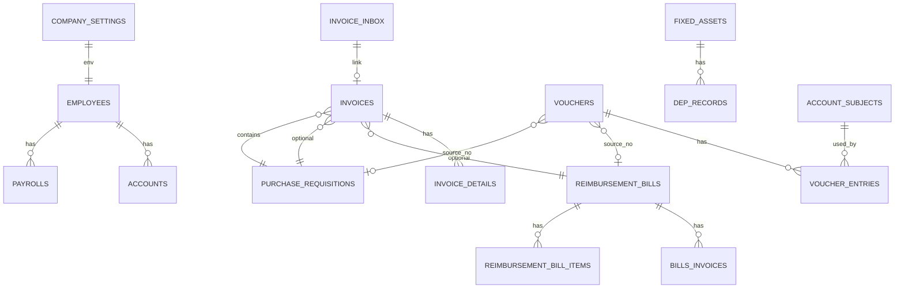

# AICoding 架构设计 · 智慧经营 — 系统设计

> 本文档为《AICoding 架构设计》核心产物之一，对应**系统设计**。
> 上游输入：《高层架构设计》产出的业务架构、系统定位、能力盘点；
> 下游输出：用于驱动《部署设计》《安全设计》《UserStory》的实施。

---

## 0. 元信息：修订记录

| 文档版本 | 发布日期 | 修订人 | 修订说明 |
| --- | --- | --- | --- |
| v1.0 | 2026-07-24 | 寇豆码（高见远审核）| 初稿（基于现状代码盘点） |

---

## 1. 引言

### 1.1 文档目的

描述「智慧经营」系统的**应用架构、数据架构、技术架构**，明确模块边界、接口契约、数据模型、可观测设计，作为开发与测试的可执行蓝本。

### 1.2 适用范围

适用于 `mfr-cloud-finance` 仓库下 backend (FastAPI+SQLite) + frontend (Vue 3 + Vite) 完整代码库的**进一步演进与新功能接入**。

### 1.3 名词与缩写

| 名词 | 含义 |
| --- | --- |
| 凭证 | Voucher，记账凭证，含 1~N 个 VoucherEntry（分录） |
| 进项发票 | 采购方向销售方取得的增值税发票 |
| 发票箱 | invoice_inbox 表，存待识别/待挂接的发票 |
| 业务驱动账务 | 业务单据审批通过 → 自动反写凭证 |
| source_type/source_no | 业务单据类型 + 单号，凭证溯源幂等键 |
| 表结法 | 不需要结转损益凭证即可获得年末「本年利润」 |
| OCR | 光学字符识别，图片型发票兜底 |
| HMAC | 自签 Token 方案（hashlib + secrets） |
| PBKDF2 | 密码哈希算法 |

---

## 2. 业务架构

### 2.1 业务架构图

参见《高层架构设计》§5.1 一致的 3 层结构。

### 2.2 系统边界

| 边界内 | 边界外（不做的） |
| --- | --- |
| 7 大域业财一体化 | 多组织/多账套 |
| 发票识别 + 凭证自动反写 | 银行流水直连 |
| 报表导出（Excel/PDF） | 移动原生 App |
| 单机 SQLite 持久化 | 外采 OCR 服务（tesseract.js 足够） |

### 2.3 业务能力清单

| 业务能力 | 模块归属 | 一句话定义 |
| --- | --- | --- |
| 业务单据维护 | 报销/采购/差旅/合同 | 录入 → 审批 → 支付 |
| 进项发票管理 | 进项发票 | 录入/编辑/列表/归档 |
| 发票识别 + 发票箱 | 发票箱 | 上传→OCR→挂接 |
| 凭证自动反写 | 凭证引擎 | 业务单据 → 凭证（幂等） |
| 账簿/总账/明细账 | 账簿 | 由凭证汇总实时派生 |
| 财务报表 | 报表 | 资产负债表/利润表/现金流量表/季报（表结法） |
| 工资/个税 | 工资 | 月度处理 |
| 税务 | 税务 | 汇总/个税/印花税 |
| 鉴权 | 鉴权 | 登录+token+中间件 |

---

## 3. 应用架构

### 3.1 应用架构概览

```
┌─────────────────────────────────────────────┐
│ Vue 3 SPA (frontend/)                       │
│   ├─ Pinia (state)                          │
│   ├─ Vue Router (Hash)                      │
│   ├─ Element Plus (UI)                      │
│   └─ utils: invoiceParser/invoiceFields/    │
│     exportReport/requests/...               │
└─────────────────────┬───────────────────────┘
                      │ HTTPS JSON (Bearer token)
┌─────────────────────▼───────────────────────┐
│ FastAPI (backend/)                          │
│   ├─ CORS middleware (本地源)              │
│   ├─ Auth dependency (get_current_user)     │
│   ├─ Routers (api/*.py)                     │
│   ├─ Services (services/*.py)               │
│   ├─ Models (SQLAlchemy ORM)                │
│   ├─ Schemas (Pydantic)                     │
│   ├─ Utils (security/codegen/...)           │
│   └─ DB (SQLite 文件 + 列迁移)              │
└─────────────────────┬───────────────────────┘
                      │ File I/O
┌─────────────────────▼───────────────────────┐
│ 文件存储                                    │
│   ├─ backend/uploads/invoices/  (挂接后归档)│
│   └─ backend/uploads/inbox/      (发票箱原文件)│
└─────────────────────────────────────────────┘
```

### 3.2 模块详细设计

#### 3.2.1 鉴权模块 (`app/api/auth.py`, `app/utils/security.py`)

**职责**：登录获取 token、HTTP 中间件校验 token。

**接口**：

| 端点 | 方法 | 入参 | 出参 | 鉴权 |
| --- | --- | --- | --- | --- |
| `/api/auth/login` | POST | `{username, password}` | `{token, username, role, ...}` | 公开 |
| `/api/auth/me` | GET | — | `CurrentUser` | Bearer |

**Token 格式**：自签 HMAC-SHA256，3 段 `header.payload.signature`，payload 含 `sub/role/emp/exp`。

**密钥管理**：`_load_auth_secret()` 优先级 `AUTH_SECRET > .auth_secret 文件 > 内存随机`；文件首启生成 32 字节随机 hex + chmod 600。

#### 3.2.2 进项发票模块 (`app/api/invoice.py`, `app/models/invoice.py`)

**职责**：进项发票 CRUD、与报销单关联、自动根据发票反写凭证。

**数据模型**：

```python
class Invoice(Base):
    id: int (PK)
    invoice_code: str (UQ, 16 位可读编码 FP+YYYYMMDD+类型码+序号)
    bill_id: int (FK → reimbursement_bills.id, nullable, index)
    purchase_requisition_id: int (FK → purchase_requisitions.id, nullable, index)
    invoice_no: str (发票号码)
    invoice_date: date
    seller_name / seller_tax_no / buyer_name / buyer_tax_no
    total_amount / tax_amount / amount
    type: str (special/general/electronic)
    attachment_path: str
    remark: str
    created_at / updated_at
```

#### 3.2.3 发票箱模块 (`app/api/invoice_inbox.py`, `app/models/invoice_inbox.py`)

**职责**：暂存待识别发票、状态机、挂接到业务单后生成正式 Invoice。

**端点**：

| 端点 | 方法 | 说明 |
| --- | --- | --- |
| `/api/invoice-inbox` | GET | 列表（按 status + keyword 筛选） |
| `/api/invoice-inbox/{id}` | GET/PUT/DELETE | 详情/校正/删除 |
| `/api/invoice-inbox/upload` | POST (multipart) | 上传原文件 + extracted_json |
| `/api/invoice-inbox/{id}/link` | POST | 挂接业务单（reimburse/purchase）→ 生成正式 Invoice |
| `/api/invoice-inbox/{id}/verify` | POST | 登记查验结果（real/fake/abnormal） |

**状态机**：`pending → recognized → linked`（或 `error`）。

**数据模型**：

```python
class InvoiceInbox(Base):
    id, filename, file_path, file_size, content_type
    status: str (pending/recognized/linked/error)
    extracted_json: text (前端 InvoiceRecognizeDialog 解析结果)
    verify_result: str (real/fake/abnormal/None)
    verify_note: str
    linked_invoice_id: int (FK → invoices.id, nullable)
    link_doc_type: str (reimburse/purchase)
    link_doc_id: int
    created_at, updated_at
```

#### 3.2.4 报销单模块 (`app/api/reimburse.py`, `app/models/reimburse.py`)

**职责**：报销单 CRUD、审批、支付、发票关联。

**端点（关键）**：

| 端点 | 说明 |
| --- | --- |
| `/api/reimburse/...` | CRUD |
| `/api/reimburse/{id}/approve` | 审批（必填 approver + remark） |
| `/api/reimburse/{id}/reject` | 驳回 |
| `/api/reimburse/{id}/pay` | 支付（联动生成付款凭证） |
| `/api/reimburse/next-bill-no` | 预占单号 `BXGL+4 位年+4 位年自增` |

**状态**：`draft → submitted → pending_approval → approved → paid`（或 `rejected`）。

#### 3.2.5 采购模块 (`app/api/purchase.py`, `app/models/purchase.py`)

**职责**：采购申请 CRUD、审批、支付、状态机。已支持与发票箱挂接（`purchase_requisition_id` FK 已加在 Invoice 模型）。

#### 3.2.6 差旅/工资/合同/资产/税务模块

- 差旅：差旅专属字段 + 集成进报销单
- 工资：月度工资单 + 个税申报（按月度税率表）+ 分摊
- 合同：4 类（客户/供应商/采购/销售）抽屉
- 固定资产：入账/折旧/处置自动生成凭证（23 测试守护）
- 税务：汇总/个税申报/印花税（按合同 0.03%）

### 3.3 业务能力层与基础能力层的契约

**业务能力层 → 凭证引擎**：

```python
# 业务单据审批通过 → 触发 voucher_service.generate(...)
voucher_service.generate(
    source_type="reimbursement_bill",   # 幂等键 1
    source_no=bill.bill_no,             # 幂等键 2
    entries=[                             # 分录
        {"subject_code": "5602.01", "direction": "debit", "amount": 2840.00},
        {"subject_code": "2221.01.01", "direction": "debit", "amount": 160.00},
        {"subject_code": "1002", "direction": "credit", "amount": 3000.00},
    ],
    summary=f"报销单 {bill.bill_no}",
)
# 重复调用幂等：(source_type, source_no) 唯一 → 不会重复写
```

### 3.4 横切公共能力

| 横切能力 | 实现位置 |
| --- | --- |
| 全局异常处理 | `main.py` `_unhandled_exception_handler` 返回通用 500 + 日志记录 |
| CORS | `main.py` `_ALLOWED_ORIGINS` 本地源 |
| 鉴权 | `main.py` `_AUTH_DEP = [Depends(get_current_user)]` 挂到所有业务 router |
| 列迁移 | `db/database.py` `_ensure_*_columns` 防止重复 ALTER |
| 乐观锁编码 | `utils/codegen.py` + `code_counter.py` 表 |
| 全局异常包装 | `main.py` 不泄露 500 堆栈 |
| 上传存储 | `backend/uploads/{invoices,inbox}` (gitignore) |

### 3.5 接口契约（关键端点签名）

| 模块 | 端点 | 入参（关键字段） | 出参（关键字段） |
| --- | --- | --- | --- |
| 鉴权 | POST /api/auth/login | `{username,password}` | `{token,...}` |
| 进项发票 | POST /api/invoices | `InvoiceCreatePayload` | `Invoice` |
| 进项发票 | GET /api/invoices | `?period=&keyword=` | `Invoice[]` |
| 发票箱 | GET /api/invoice-inbox | `?status=&keyword=` | `InvoiceInbox[]` |
| 发票箱 | POST /api/invoice-inbox/upload | Form: file + extracted_json | `InvoiceInbox` |
| 发票箱 | POST /api/invoice-inbox/{id}/link | `{doc_type,doc_id}` | `InvoiceInbox` (linked) |
| 报销单 | GET /api/reimburse/mine | `?applicant=&status=` | `ReimbursementBill[]` |
| 报销单 | POST /api/reimburse/{id}/approve | `{approver,remark}` | `ReimbursementBill` |
| 财务报表 | GET /api/financial/balance-sheet | `?period=YYYY-MM` | `BalanceSheet` |
| 报表导出 | (前端 utils/exportReport.ts) | 报表 + 格式 | `.xlsx` / pdf 打印窗口 |

---

## 4. 数据架构

### 4.1 数据库选型

**SQLite**（单机）理由：
- 30 人公司 QPS ≤ 10，无需并发写
- 文件级备份简单（tar + sftp）
- 与 FastAPI + SQLAlchemy 一等公民集成

### 4.2 实体清单

| 实体 | 表名 | 主键 | 关键字段 | 索引 |
| --- | --- | --- | --- | --- |
| 用户/账号 | employees / accounts | id | username, password_hash, role | username UQ |
| 报销单 | reimbursement_bills | id | bill_no (UQ), status, approver | bill_no |
| 报销单发票 | bills_invoices | id | bill_id, invoice_no | (bill_id,invoice_no) UQ |
| 报销单明细 | reimbursement_bill_items | id | bill_id, kind, amount | bill_id |
| 进项发票 | invoices | id | invoice_no, seller_tax_no, invoice_code (UQ) | invoice_code, bill_id, purchase_requisition_id |
| 进项发票明细 | invoice_details | id | invoice_id | invoice_id |
| 发票箱 | invoice_inbox | id | status, extracted_json | (status, filename) |
| 采购申请 | purchase_requisitions | id | req_no (UQ) | req_no |
| 差旅单 | travel_bills | id | bill_no | bill_no |
| 工资单 | payrolls | id | period | (period, emp_id) UQ |
| 员工 | employees | id | employee_no (UQ) | employee_no |
| 合同 | purchase_contracts / sales_contracts / hr_contracts | id | contract_no | contract_no |
| 固定资产 | fixed_assets | id | asset_code | asset_code |
| 折旧记录 | dep_records | id | asset_id, period | (asset_id,period) UQ |
| 公司设置 | company_settings | id=1 | tax_no, name | — |
| 科目 | account_subjects | id | code | code UQ |
| 凭证 | vouchers | id | source_type+source_no | source UQ |
| 分录 | voucher_entries | id | voucher_id, subject_code | voucher_id |
| 编码计数器 | code_counters | id | (biz_type, scope) | (biz_type,scope) PK |

### 4.3 关键表结构（精简）

```sql
-- 28 种子科目
CREATE TABLE account_subjects (
    id INTEGER PRIMARY KEY,
    code VARCHAR(20) UNIQUE,
    name VARCHAR(100),
    parent_code VARCHAR(20),
    category VARCHAR(10),  -- asset/liability/equity/cost/profit
    direction VARCHAR(10), -- debit/credit
    level INTEGER
);

-- 业务单据→凭证幂等
CREATE TABLE vouchers (
    id INTEGER PRIMARY KEY,
    voucher_no VARCHAR(20) UNIQUE,
    period VARCHAR(7),
    source_type VARCHAR(50),
    source_no VARCHAR(50),
    summary TEXT,
    status VARCHAR(20),
    UNIQUE(source_type, source_no)  -- 幂等关键
);
CREATE TABLE voucher_entries (
    id INTEGER PRIMARY KEY,
    voucher_id INTEGER REFERENCES vouchers(id),
    subject_code VARCHAR(20),
    direction VARCHAR(10),
    amount NUMERIC(18,2)
);

-- 发票箱（已建）
CREATE TABLE invoice_inbox (
    id INTEGER PRIMARY KEY,
    filename VARCHAR(255),
    file_path VARCHAR(255),
    status VARCHAR(20),
    extracted_json TEXT,  -- JSON 字符串
    verify_result VARCHAR(20),
    verify_note TEXT,
    linked_invoice_id INTEGER,
    link_doc_type VARCHAR(20),
    link_doc_id INTEGER,
    created_at, updated_at
);
```

### 4.4 缓存与 Key 规范

- **当前无 Redis**，全走 DB
- 报表聚合用**账套版本缓存**：在 `ledger_service._aggregate` 内置失效键=凭证分录行数+最大 id
- 自定义一致哈希（如扩展时）：`领域:业务:维度:时间`

### 4.5 数据迁移与兼容性

- 列迁移函数命名规范：`_ensure_<table>_<column>_column`
- 防护逻辑：先 `inspect(engine).get_columns(...)`，列已存在则跳过
- 示例：`_ensure_invoice_columns` 给已存在的 `invoices` 表加 `purchase_requisition_id`
- 数据导入：用 `python -m app.db.seeds` 幂等（已具备 28 种子 + 公司设置）

### 4.6 数据隔离

- 单租户：无 schema 隔离
- 公司数据 soft-delete：当前用 `is_active` 字段（部分模块）

### 4.7 数据保留与归档

- 当前未归档：业务表数据永久保留
- 上传文件：`backend/uploads/invoices/` 长期保留；`backend/uploads/inbox/` 挂接后删除（去重）

---

## 5. 部署架构

参见《部署设计》。简述：

- 单机部署：FastAPI（uvicorn 8521）+ SQLite 文件 + Vite 静态构建产物（Nginx）
- 备份：每日 tar 包含 `smart_finance.db + uploads/ + .auth_secret`
- 网络：CORS 收紧到 4 个本地源；HTTPS 由 Nginx 提供
- 可观测：uvicorn 标准访问日志 + 业务自定义 logger；故障统一 500 包装

---

## 6. 可观测设计

### 6.1 日志

- 框架：Python `logging` (uvicorn.error 默认)
- 业务日志：`logger.exception("未捕获异常: %s %s", method, path)`
- 格式：默认文本，关键事件加结构化 key

### 6.2 指标（KPI）

| 指标 | 采集方式 | 用途 |
| --- | --- | --- |
| 业务单据转化率 | 定期 SQL count | 老板仪表盘 |
| 凭证自动化率 | 业务单 vs 凭证对账 | 完整版监控 |
| 发票识别准确率 | 离线 fixture 测试 | 23 + 34 测试守护 |

### 6.3 监控告警

- 当前：未接 APM（单机自用）
- 建议：cron 巡检 `tail backend.log` + 异常即通知（待完整版）

### 6.4 请求 ID / 链路追踪

- 当前无 trace_id
- 完整版建议：通过 `contextvars` 注入 `request_id`

---

## 7. 安全设计

参见《安全设计》。简述：

- 鉴权：自签 HMAC token
- CORS：本地源白名单
- SQL 注入：SQLAlchemy ORM（参数化）
- 密码：PBKDF2 哈希
- 密钥：`.auth_secret` 文件 chmod 600
- 上传文件：gitignore + 路径白名单
- 全局异常：500 包装不泄露堆栈

---

## 8. 演进与迁移规划

| 阶段 | 演进点 | 兼容性 |
| --- | --- | --- |
| 当前 | MVP 全量 | — |
| 完整版 | 期末结账/季报一键化 | 数据 schema 不变 |
| 未来 | 多账套 | 需 schema 隔离或 database-per-tenant |
| 未来 | 微服务 | 拆分业务能力层为独立服务（凭证引擎/发票/报表/鉴权） |

---

## 附录 A：数据字典与表关系

### A.1 ER 图



---

> 寇豆码 签名 · 高见远 审核 · 2026-07-24
