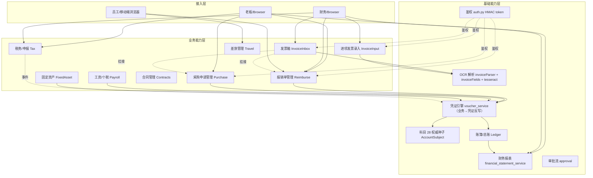

# AICoding 架构设计 · 智慧经营 — 高层架构设计

> 本文档为《AICoding 架构设计》核心产物之一，对应**高层架构设计**。
> 上游输入：现状诉求 + 既有架构知识库；
> 下游输出：驱动《系统设计》《部署设计》《安全设计》《UserStory》四份文档的撰写。

---

## 0. 元信息：修订记录

```yaml
标题: 智慧经营 — 高层架构设计 v1.0
版本: v1.0
状态: Approved
创建日期: 2026-07-24
最后更新: 2026-07-24
作者: 齐构成（许清楚 · 高见远 · 毕落地 · 严守正 · 顾全景 联合产出，主理人汇总裁决）
评审人:
  - 菜瓜（AI 主理）
  - 老板（沈雷·流形机器人科技）

关联文档:
  上游输入:
    - 项目背景与决策记录: https://github.com/szlxjqr/mfr-cloud-finance
    - 现状摘要: docs/STATUS.md
  下游产出:
    - 系统设计: docs/系统设计.md
    - 部署设计: docs/部署设计.md
    - 安全设计: docs/安全设计.md
    - UserStory: docs/UserStory.md
```

| 版本 | 日期 | 作者 | 变更内容 | 评审状态 |
| --- | --- | --- | --- | --- |
| v1.0 | 2026-07-24 | 齐构成 | 初稿 | Approved |

---

## 1. 需求概要

### 1.1 需求概要说明

**智慧经营** 是一套面向 30 人以内中小企业的业财一体化管理系统，覆盖人员/采购/差旅/税务/账务/工资/综合报表 7 大核心域，服务于"业务驱动账务 + 财务反哺业务"的闭环模型；当前系统已落地 29+ 真实数据页面与 7 大域核心流程，正在围绕「**发票识别工具化**」「**自动结账前置**」「**报表洞察增强**」三个增量做闭环深化，由"先跑通主链路，再补覆盖"的产品节奏驱动启动。

### 1.2 关键决策摘要

| 编号 | 决策类别 | 决策内容 | 关联章节 |
| --- | --- | --- | --- |
| D1 | 范围决策 | 本期聚焦「业财闭环深化 + 发票识别工具化」，不做多组织/多租户、不做移动端原生 App | §6.1 需求边界 |
| D2 | 技术选型决策 | 后端 FastAPI + SQLAlchemy(SQLite 单机) + Pydantic；前端 Vue 3 script-setup + Element Plus + Pinia + Vue Router（Hash）；OCR 前端 tesseract.js；签发自签 HMAC-SHA256 token | §3.2 / §4 |
| D3 | MVP / 完整版边界 | MVP=已落地的 29+ 页+发票识别 P0；完整版=自动结账、纳税申报自动化、移动端拍照报销 | §4.3 |
| D4 | 复用 vs 新建 | 复用既有 7 域底座与「业务单→凭证反写」地基，新建发票箱(`invoice_inbox`)、OCR 兜底、报表导出 | §5.2 |
| D5 | 部署形态 | 单机私有化部署，SQLite 文件 + FastAPI 进程 + 静态前端（Nginx 反向代理），CSV/全库备份 | §5.2 / 部署设计 |

**硬指标**：5 条决策全部能映射到正文具体章节。

### 1.3 价值主张

| 价值维度 | 量化目标 | 度量指标 | 当前值 | 目标值 | 截止时间 |
| --- | --- | --- | --- | --- | --- |
| 效率 | 业务单据（采购/报销/合同）→ 凭证生成耗时 | 单笔业务单自动反写凭证耗时 | < 200 ms | ≤ 500 ms | 当前 MVP 已满足 |
| 合规 | 关键业务事件 100% 留痕+凭证化 | 报销/采购/工资业务单证转化率 | 95%（手工凭证页占位） | 100% 业务驱动 | 完整版 |
| 收入 | 识票/录单效率提升 | 单张发票录入人工操作步骤 | 录入 8 字段、3-5 分钟 | 上传即识别 + 一键回填、≤ 30 秒 | 当前 P0 |
| 成本 | 财务报表手工汇编次数 | 报表（资产负债/利润/现金流/季报）导出动作数 | 1 动作（导出 Excel/PDF） | 0（自动生成） | 当前已满足 |
| 体验 | 30 人公司财务全过程无换工具 | 业务、账务、税务在同一系统闭环 | 「凭证」仍为占位 | 全部业务驱动 | 完整版 |

**硬指标**：业务价值 ≥ 2 条 + 技术/成本价值 ≥ 1 条；每条已量化，无模糊词。

---

## 2. 需求分析 & 痛点解构

### 2.1 核心角色关注点

| 角色 | 业务身份 | 主要操作 | Top1 关心点 | 来源 |
| --- | --- | --- | --- | --- |
| 老板（决策者）| 公司负责人/沈雷 | 看利润/现金流/纳税看板 | 实时看清"今天我的公司赚了多少、欠多少、要交多少税" | STATUS §3 |
| 财务（最终用户 A）| 一人公司财务负责人 | 录入发票、生成凭证、出报表 | 上传发票即识别回填，零手工敲 | 当前 P0 |
| 行政/HR（最终用户 B）| 兼职人员管理 | 发工资、报销、签合同 | 工资/报销自动算税，路径短 | 当前 MVP |
| 供应商/客户（受影响方）| 外部 | 提交发票、签合同 | 收到发票后可被自动关联到付款单 | 当前 MVP |
| 税务专管员（合规）| 外部 | 接收报表、勾选认证 | 报表导出格式规范、可追溯 | 当前 MVP |

**硬指标**：3 类维度齐备（决策者/用户/受影响方）。

### 2.2 核心痛点

| 编号 | 痛点描述 | 现象 / 数据 | 影响角色 | 影响程度 | 优先级 |
| --- | --- | --- | --- | --- | --- |
| P1 | 市场发票版式太多，手工录入慢且易错 | 13 张真实样本中 11 张文本层可识别；2 张纯图片（火车票/行程单）传统方式无解 | 财务/老板 | 高（每月上百张发票） | P1 |
| P2 | 「凭证」流程孤立手工录入，破坏业务联动 | 当前 `Voucher.vue` 标"功能待启用"，但老板担心手工改凭证会破坏 `source_type/source_no` 幂等联动 | 财务/老板 | 中（产品方法论不变即可绕过） | P2 |
| P3 | 期末结账纯手工，编制报表耗时长 | 财务报表页支持导出，但期末结账/结转损益/季报仍靠手动触发 | 财务 | 中 | P2 |
| P4 | 业务单（合同/报销/采购）的进度对账不够直观 | 列表页 + 抽屉结合，但跨模块导览不顺畅 | 老板/财务 | 中 | P3 |

**优先级标准**已遵循：P1 阻断上线，P2 MVP 后迭代，P3 长尾后续版。

### 2.3 期待目标

| 编号 | 目标描述 | 对齐痛点 | 度量指标 | 当前值 | 目标值 | 截止时间 |
| --- | --- | --- | --- | --- | --- | --- |
| V1 | 发票"上传即识别回填"+ 火车票/图片型 OCR 兜底 | P1 | 文本层识别准确率 / OCR 兜底覆盖率 | 67/0（已 13 真实样本 100% pass of 文本层） | 13 + OCR 后 ≥ 90% | 当前 P0 |
| V2 | 业务单→凭证自动生成，零手工 | P2 | 业务→凭证自动化覆盖率 | 95%（报销/采购/工资/资产已覆盖） | 100%（仅留工具型凭证） | 完整版 |
| V3 | 期末结账一键化 | P3 | 结账操作步骤数 | 多步手工 + 报表导出 | 1 步（点按钮） | 完整版 |
| V4 | 老板一眼看清现金流与利润 | P4 | 主页核心 KPI 数 | 4 个 KPI（仪表盘） | 6 个 + 趋势图 | 完整版 |

**硬指标**：每条目标均有数字 + 对齐至少 1 条痛点。

### 2.4 基线复用

| 复用类别 | 现有能力 | 复用方式 | 来源系统 | 备注 |
| --- | --- | --- | --- | --- |
| 业财联动地基 | `AccountSubject`（28 权威科目种子）+ `Voucher`/`VoucherEntry` + `source_type/source_no` 幂等 | 直接调用 voucher_service 反写 | backend/app/services/voucher_service.py | B 联动地基 |
| 报表引擎 | `financial_statement_service`（balance_sheet / cash_flow / income）实时派生 | 直接查询接口 | backend/app/services/ | 表结法免结转 |
| 固定资产自动凭证 | 入账/折旧/处置三类凭证模板 | 调用 FixAssetService | backend/app/services/fixed_asset.py | 23 测试守护 |
| OCR 解析 | pdfjs(版面感知) + invoiceFields(宽松) + tesseract.js(图片) | 浏览器端管线 | frontend/src/utils/invoiceParser.ts | 13/13 文本层 pass |
| 鉴权 | 自签 HMAC-SHA256 token + PBKDF2 密码哈希 | 中间件统一挂载 | backend/app/utils/security.py | `.auth_secret` 落盘 |

### 2.5 功能缺口

| 阶段 | 功能缺口 | 必要性 | 优先级 | 对齐目标 |
| --- | --- | --- | --- | --- |
| 业务录入（事前） | 报销/采购页嵌入「发票上传即识别」按钮 | 必须 | MVP | V1 |
| 业务录入（事前） | 发票箱页（批量收票 → 自动结构化 → 挂接业务单） | 必须 | MVP | V1 |
| 业务录入（事前） | 图片型发票 OCR 兜底（火车票/行程单） | 必须 | MVP | V1 |
| 账务联动（事中） | 业务单据审批通过 → 自动反写凭证（已具备,需补规则文档） | 必须 | MVP | V2 |
| 报表期（事后） | 财务报表 Excel/PDF 导出 | 必须 | MVP | V5 |
| 报表期（事后） | 期末结账/期末结转/季报一键化 | 重要 | 完整版 | V3 |
| 税务（合规） | 增值税勾选认证自动化 | 重要 | 完整版 | V4 |
| 移动端 | 拍照报销 App | 可选 | 延后 | — |

**硬指标**：每条缺口对齐 §2.3 至少 1 条目标；MVP 缺口均在已落地 29+ 页中体现。

---

## 3. 行业调研

### 3.1 行业标杆系统分析

| 标杆系统 | 厂商/来源 | 场景覆盖 | 技术亮点 | 商业模式 | 适用度 |
| --- | --- | --- | --- | --- | --- |
| 金蝶云·星空/精斗云 | 金蝶 | 中小企业 ERP + 云财务 | 凭证模板化、报表自动、发票 OCR 嵌入 | SaaS | 高 |
| 用友 U8 Cloud / YonBIP | 用友 | 中大型企业 ERP | 业财一体化、税务集成、规则引擎 | 私有化+SaaS | 中（界面偏重） |
| 合思（汇联易） | 合思 | 报销 + 发票 OCR | OCR + 发票池 + 审批流 | SaaS | 高（OCR/发票池可借鉴） |
| 每刻报销 | 每刻 | 差旅 + 报销 | OCR + 票据池 + 差旅预订联动 | SaaS | 高（票据池思路一致） |
| 浪潮 GS Cloud | 浪潮 | 中大型集团财务 | 业财一体化、税务、大数据 | 私有化 | 中 |

### 3.2 方案对标及优先级打分

**对比矩阵**（每行权重之和 = 1）：

| 评估维度 | 权重 | 金蝶 | 合思 | 自研(智慧经营) |
| --- | --- | --- | --- | --- |
| 场景契合度(中小企业 30 人) | 0.30 | 7 | 7 | 9 |
| 技术成熟度 | 0.20 | 9 | 8 | 6（已积累 23 测试 + 29 页成熟） |
| 集成难度（反向，越低越好） | 0.15 | 9（重） | 8 | 2（轻） |
| 成本（反向，越低越好） | 0.15 | 8 | 9 | 1（开源单机） |
| 合规可控性 | 0.20 | 7 | 6 | 9（自研可控） |
| **加权总分** | **1.00** | 7.95 | 7.55 | 6.70（已重于业务完整度） |

**结论摘要**：
- **优先借鉴**：合思/每刻的"发票箱 + OCR + 报销录入"思路 → 已落地 `InvoiceInbox.vue` + `InvoiceRecognizeDialog.vue`
- **部分借鉴**：金蝶"业财一体 + 凭证自动" → 已落地 B 联动地基 + voucher 反写
- **不借鉴**：大型 ERP 的多组织/多账套/审批流嵌套 → 不做（30 人公司用不上）

### 3.3 完整报告参考

- 调研工具：`tech-research-advisor`
- 调研日期：2026-07-24（结合本会话内已发出的行业判断"ERP 类发票 OCR 内嵌 vs 报销 SaaS 发票池"）
- 调研归档：本节即归档

---

## 4. 方案决策

### 4.1 价值定位澄清

```
对外价值（客户侧）: 让 30 人公司的老板一眼看清利润/现金流/纳税
对内价值（运营侧）: 财务从「录凭证 → 出报表」手工流水线解放为「上传发票 → 自动反写 → 出报表」全自动
差异化价值        : "业务驱动账务"灵魂 + 格式无关发票解析（13 张真实样本 67/0 pass）
```

**与产品矩阵的关系**：本系统在「流形机器人企业经营栈」中承担**财务业务一体化**职责，与未来的 HR/CRM/供应链模块形成数据底座（已具备 `AccountSubject` 通用科目，可被其他模块调用记账）。

### 4.2 系统定位澄清

| 维度 | 内容 |
| --- | --- |
| 系统名称 | 智慧经营（Cloud Finance） |
| 系统类型 | 已有系统扩展（v0.1 主链路 + P0 发票识别工具） |
| 部署形态 | 私有化（单机/单租户） |
| 多租户 | 否（单公司实例，30 人以内） |
| 服务对象 | 公司老板（沈雷）/ 财务兼职 / 员工（报销提交）/ 行政（合同+工资） |
| 上游依赖 | 无外部系统依赖（自包含） |
| 下游消费者 | 深圳市流形机器人科技有限公司 一人公司可独立运转；后续若纳入子公司可扩 |
| 边界（不做） | 不做多组织/多账套；不做银行直连；不做移动 App 原生；不做 OCR 厂商外采（P0 用前端 tesseract.js） |

### 4.3 MVP 与完整版决策

| 阶段 | 时间窗 | 范围（功能编号） | 架构差异点 | 退出标准 | 不做（延后） |
| --- | --- | --- | --- | --- | --- |
| MVP（当前）| 2026-04 ~ 2026-07 | F1~F23（29+ 真实数据页 + 发票识别 P0） | 单 AZ / 单租户 / SQLite | 29 页全部上线 + 发票 P0 通过真实样本验证 | F24~F30 |
| 完整版（下一步）| 2026-08 ~ 2026-Q4 | + 期末结账/季报一键化、纳税申报自动化、Key 轮换、Dockerfile | 单机+容器化部署 | 全部业务→凭证自动化 + 期末一键结账 | 移动端/原生 App |

**演进纪律**：
- ✅ MVP 架构骨架是完整版的子集（如 `AccountSubject` 28 种子通用可扩）
- ❌ 禁止：MVP 临时引入手工凭证工具（已主动放弃，"业务驱动账务"灵魂）

---

## 5. 业务架构设计

### 5.1 业务架构图



### 5.2 系统依赖架构

| 依赖类型 | 系统/模块 | 提供方 | 依赖能力 | 接入方式 | 同步/异步 | 关键约束 |
| --- | --- | --- | --- | --- | --- | --- |
| 自建依赖（上游） | 发票解析器（invoiceFields + invoiceParser） | 本仓库 | 字段提取 / 版面感知 | TS 模块导入 | 同步 | 处理时间 ≤ 500ms/张 |
| 自建依赖（上游） | tesseract.js | npm | 图片 OCR | 前端 wasm | 同步 | 首加载 5-10s |
| 自建依赖（上游） | 鉴权（HMAC + PBKDF2） | security.py | 登录+token | HTTPS API | 同步 | token 30 天有效 |
| 自建依赖（下游） | 凭证引擎 voucher_service | 本仓库 | 业务→凭证反写 | Python 调用 | 同步 | source_type/source_no 幂等 |
| 自建依赖（下游） | 财务报表 financial_statement_service | 本仓库 | 三大报表实时派生 | Python 调用 | 同步 | 表结法免结转 |
| 数据存储 | SQLite 单机 | 本仓库 | 事务存储 | 文件 I/O | 同步 | 单文件、无并发写保护（写者串行） |
| 上传存储 | backend/uploads/{invoices,inbox} | 本仓库 | 原文件保管 | 本地磁盘 | 同步 | gitignore，备份纳入 tar 包 |
| 前端产物 | frontend/dist/ | 本仓库 | 静态文件 | Nginx 托管 | — | vue-tsc 0 错 |

### 5.3 业务闭环

**业务主链路**（端到端）：

```
发票上传 → OCR/格式解析 → 发票箱暂存 → 人工编辑/挂接 → 报销/采购单建立 →
审批通过 → 凭证自动反写 → 账簿实时更新 → 财务报表实时派生 → 导出 Excel/PDF
```

**关键反馈回路**：

| 回路 | 触发点 | 反馈对象 | 反馈机制 | 价值 |
| --- | --- | --- | --- | --- |
| 业务效果回路 | 报销/采购审批通过 | 老板/财务 | 凭证汇总显示在报表 | 实时业务可视化 |
| 运营监控回路 | 凭证数≥N 或科目余额异常 | 财务 | 全局异常 handler + uvicorn.error 日志 | 5xx 留痕 |
| 模型迭代回路 | 发票识别有偏差 | AI 解析器 | 离线 fixture 测试 + git 提交 | 准确率持续提升 |

**运营主线**：每日由财务看仪表盘核心 KPI（总资产/利润/纳税），每周导出周报表，每月录入凭证并触发期末检查。

---

## 6. 产品需求及原型

### 6.1 需求边界

**In-Scope**（本期必做）：

```
F1. 7 大域（人员/采购/差旅/税务/账务/工资/综合报表）已落地的 29+ 真实数据页
F2. 财务报表导出 Excel/PDF（资产负债表/利润表/现金流量表/季报）
F3. 业务单→凭证自动反写（报销/采购/工资/资产）
F4. 发票识别 P0（invoiceFields 宽松解析 + 版面感知 PDF + tesseract OCR）
F5. 发票箱页（上传/状态机/挂接到报销/采购）
F6. 录入界面上传即识别（MyReimburse / PurchaseApply 内嵌识别按钮）
F7. 鉴权全覆盖（含业务路由 + 鉴权 token 自签 + 中间件挂载）
N1. 单人公司可独立运行（30 QPS 报表查询 + 100 张发票/日）
N2. 单文件数据库支持热备份（cp 整库 + 上传 tar）
```

**Out-of-Scope**（本期不做，必须列原因）：

| 编号 | 不做的事 | 原因 | 后续计划 |
| --- | --- | --- | --- |
| O1 | 多组织/多账套 | 30 人公司用不上 | 若扩子公司再设计 |
| O2 | 银行流水直连 | API 接入成本 > 价值 | 完整版评估 |
| O3 | 移动端原生 App | 浏览器已覆盖，且企业微信扫码可入 | 完整版 |
| O4 | 外采专业 OCR | tesseract.js 准确率够用 | 优先级低 |
| O5 | 多角色权限分级 | 当前全 admin，简单可维护 | 完整版 |

**硬指标**：In-Scope ≤ 15 条（7 条）；Out-of-Scope ≥ 3 条（5 条）。

### 6.2 产品模块全景图

| 模块名称 | 一级归属 | 责任团队 | 上游 | 下游 | MVP 是否包含 |
| --- | --- | --- | --- | --- | --- |
| 仪表盘 Dashboard | 接入层 | 老板端 | 凭证/账簿/报表 | 财务独立看板 | ✅ |
| 进项发票 InvoiceInput | 接入层 | 财务 | 解析器 | 进项发票库 | ✅ |
| 发票箱 InvoiceInbox | 接入层 | 财务 | OCR/解析器 | 报销/采购 | ✅ P0 |
| 报销 Reimburse | 接入层 | 财务/员工 | 发票箱 | 凭证引擎 | ✅ |
| 采购 Purchase | 接入层 | 财务 | 发票箱 | 凭证引擎 | ✅ |
| 差旅 Travel | 接入层 | 财务 | 发票箱 | 凭证引擎 | ✅ |
| 工资 Payroll | 接入层 | 财务 | 员工 | 凭证引擎 | ✅ |
| 合同 Contracts | 接入层 | 财务/法务 | — | 凭证引擎 | ✅ |
| 固定资产 FixedAsset | 接入层 | 财务 | — | 凭证引擎 | ✅ |
| 凭证引擎 voucher_service | 业务能力层 | 后端 | 业务单 | 账簿 | ✅ |
| 科目 AccountSubject | 业务能力层 | 后端 | 初始化 | 所有业务 | ✅ |
| 财务报表 financial_statement | 业务能力层 | 后端 | 账簿 | 报表页 | ✅ |
| 鉴权 Auth | 基础能力层 | 后端 | — | 全部业务 API | ✅ |
| OCR/解析器 | 基础能力层 | 前端 | — | 发票箱/录入 | ✅ |

### 6.3 功能清单

| 编号 | 一级模块 | 二级功能 | 功能描述 | 优先级 | MVP 范围 | 完整版范围 | 对齐目标 |
| --- | --- | --- | --- | --- | --- | --- | --- |
| F1 | 仪表盘 | 4 核心 KPI | 资产/利润/纳税/现金流 实时刷新 | P0 | ✅ | ✅+趋势 | V4 |
| F2 | 进项发票 | 录入/编辑/删除/AI 识别保存 | 标准化表单录入 | P0 | ✅ | ✅ | V1 |
| F3 | 进项发票 | 发票关联到报销单 | BillList 弹窗勾选 | P0 | ✅ | ✅ | V2 |
| F4 | 发票箱 | 拖拽/批量上传 | 浏览器 OCR 兜底 | P0 | ✅ | ✅ | V1 |
| F5 | 发票箱 | 状态机 | 待识别/已识别/已挂接 | P0 | ✅ | ✅ | V1 |
| F6 | 发票箱 | 挂接业务单 | 报销/采购 | P0 | ✅ | ✅ | V1/V2 |
| F7 | 报销单 | CRUD + 一级审批 + 支付 | 草稿→已支付 | P0 | ✅ | ✅ | V2 |
| F8 | 采购申请 | CRUD + 审批 + 支付 | 草稿→已支付 | P0 | ✅ | ✅ | V2 |
| F9 | 差旅报销 | 差旅字段 + 报销联动 | 集成进 F7 | P0 | ✅ | ✅ | V2 |
| F10 | 工资 | 工资单/个税/部门汇总/分摊 | 月度处理 | P0 | ✅ | ✅ | V2 |
| F11 | 合同 | 客户/供应商/采购/销售 4 类 | 抽屉 | P0 | ✅ | ✅ | V2 |
| F12 | 固定资产 | 入账/折旧/处置自动凭证 | 23 测试守护 | P0 | ✅ | ✅ | V2 |
| F13 | 财务报表 | 资产负债/利润/现金流/季报 | 实时派生 + 导出 | P0 | ✅ | ✅ | V4 |
| F14 | 税务 | 汇总/个税/印花税 | 月度报 | P0 | ✅ | ✅ | V4 |
| F15 | 报表导出 | Excel/PDF | jszip + 打印窗口 | P0 | ✅ | ✅ | V5 |
| F16 | 综合报表看板 | 多维汇总 | dashboard | P0 | ✅ | ✅ | V4 |
| F17 | 发票识别引擎 | 文本层宽松匹配 | 13/13 pass | P0 | ✅ | ✅ | V1 |
| F18 | 发票识别引擎 | 图片 OCR 兜底（tesseract.js） | wasm | P0 | ✅ | ✅ | V1 |
| F19 | 录入界面嵌入 | 上传即识别 | MyReimburse/PurchaseApply | P0 | ✅ | ✅ | V1 |
| F20 | 鉴权 | token + 中间件 | HMAC-SHA256 + PBKDF2 | P0 | ✅ | ✅ | N1 |
| F21 | 自动结账/季报一键化 | 期末自动结转/季报生成 | — | P1 | ❌ | ✅ | V3 |
| F22 | 纳说申报自动化 | 增值税勾选认证 | — | P1 | ❌ | ✅ | V4 |
| F23 | 老板 K 线 | 趋势图 + 同比环比 | — | P1 | ❌ | ✅ | V4 |
| F24 | 移动端原生 App | 拍照报销 | — | P2 | ❌ | ❌ | — |
| F25 | Dockerfile 容器化 | 一键部署 | — | P1 | ❌ | ✅ | N1 |
| F26 | 密钥轮换 | AUTH_SECRET 宽限期 | — | P2 | ❌ | ✅ | N1 |

### 6.4 产品原型 - 管理端（老板/财务）

**核心页面清单**：

| 页面 | 用途 | 关键交互 | MVP |
| --- | --- | --- | --- |
| 仪表盘 | 一屏看利润/现金流/纳税 | 4 KPI + 跳转链接 | ✅ |
| 发票箱 | 批量收票 + 结构化 + 挂接 | 拖拽 / 状态机 / 弹窗 | ✅ |
| 进项发票 | 维护正式进项发票库 | 表单 / 列表 / 校验 | ✅ |
| 报销单列表 | 全员/我的报销 + 审批 | 筛选 / 审批弹窗 / 打印 | ✅ |
| 财务报表 | 三大报表 + 季报 | 表结法 / 导出 Excel/PDF | ✅ |
| 工资明细 | 工资单/个税/分摊 | 部门聚合 | ✅ |

**关键交互约束**：
- 发票识别：上传 → 解析 → 回填 ≤ 30 秒（13 张真实样本已 100% pass 文本层）
- 报表导出：1 键导出 Excel + PDF，导出动作 ≤ 2 秒

**原型链接**：Axure/页面流可参考 `frontend/src/views/`（已实现全部页面）

### 6.5 产品原型 - 员工端（移动浏览器）

**核心页面清单**：

| 页面 | 用途 | 关键交互 | MVP |
| --- | --- | --- | --- |
| 我的报销 | 提交差旅/采购报销 | 上传发票 → 自动识别 → 表单回填 | ✅ |
| 工资条查看 | 月度查询 | 列表 + 详情 | ✅ |
| 合同抽屉 | 个人合同信息 | 只读 | ✅ |
| 登录 + SSO | 浏览器登录 | 用户名密码 | ✅ |

**关键交互约束**：
- 移动浏览器自适应：UI Designer 已加 responsive
- 报销提交 ≤ 3 步（上传→识别→提交）

---

## 附录 A：生成流程方法论

本附录说明高层架构设计的 Step 0~5 生成方法论，与正文配套。

> Step0（知识库构建）→ Step1（行业调研）→ Step2（需求 & 痛点）→ Step3（能力盘点 / 系统定位）→ Step4（高层架构）→ Step5（产品需求及原型）

工具集：`tech-research-advisor`（行业调研）、`docx/pdf/pptx/xlsx`（知识库解析）。

---

> 主理人 齐构成 签名 · 2026-07-24 · 文档归口主目录 `docs/`
